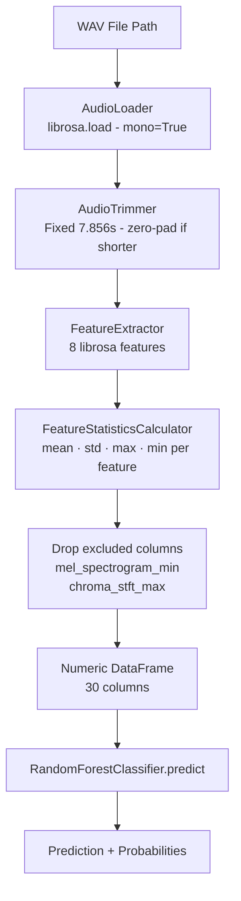
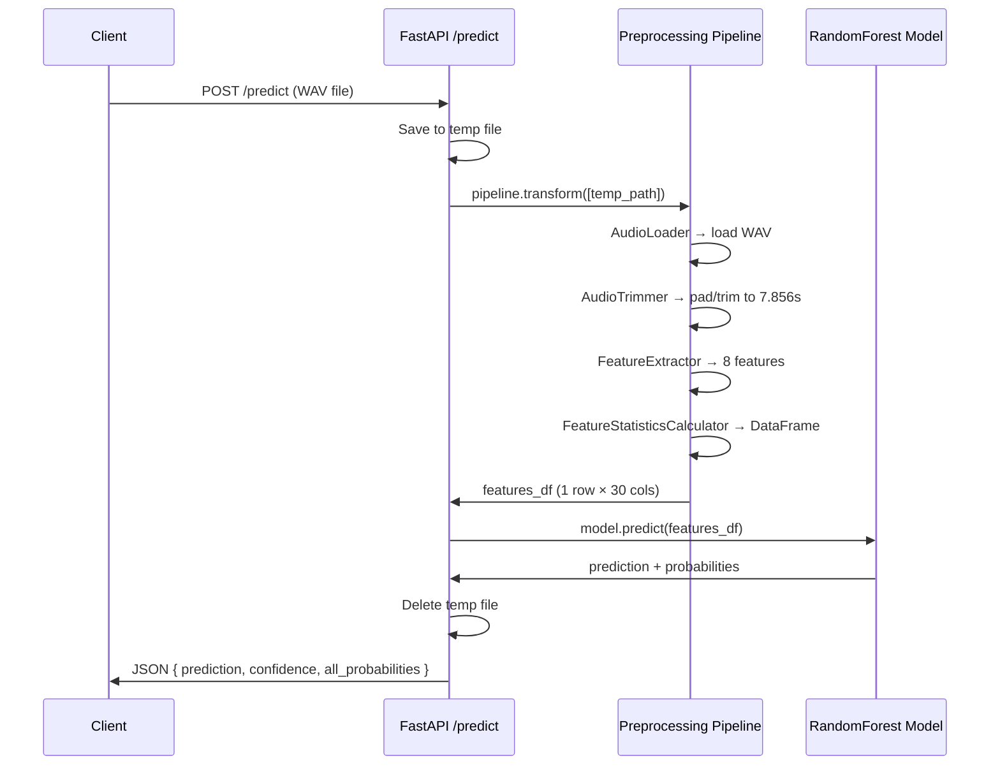
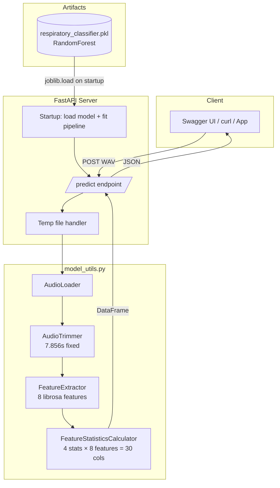

# 🫁 Respiratory Disease Classifier API

> **91% F1-Score** • Random Forest • FastAPI • CPU-only • Docker-ready

A production-ready REST API that classifies respiratory conditions from breath/cough WAV audio files using a pre-trained **Random Forest** model trained on the [ICBHI Respiratory Sound Database](https://www.kaggle.com/datasets/vbookshelf/respiratory-sound-database).

---

## Table of Contents

- [How the Model Was Built](#-how-the-model-was-built)
- [Preprocessing Pipeline](#-preprocessing-pipeline)
- [API Usage](#-api-usage)
- [Project Structure](#-project-structure)
- [Quickstart](#-quickstart)
- [Docker](#-docker)
- [Architecture Diagrams](#-architecture-diagrams)

---

## 🧠 How the Model Was Built

### Dataset
- **Source:** ICBHI Respiratory Sound Database (Kaggle)
- **Content:** 920 annotated WAV recordings from 126 patients
- **Labels:** 8 respiratory conditions

| Label | Condition |
|---|---|
| Healthy | No respiratory disease |
| COPD | Chronic Obstructive Pulmonary Disease |
| URTI | Upper Respiratory Tract Infection |
| LRTI | Lower Respiratory Tract Infection |
| Asthma | Asthma |
| Bronchiectasis | Bronchiectasis |
| Bronchiolitis | Bronchiolitis |
| Pneumonia | Pneumonia |

### Feature Engineering

Each audio file was trimmed to a **fixed duration** (7.856 seconds — the length of the shortest clip) and run through 8 librosa feature extractors. The **mean, std, max, and min** of each feature were used as the final flat vector:

| Feature | Description |
|---|---|
| `chroma_stft` | Chromagram — 12 pitch class energy |
| `mfcc` (n=13) | Mel-frequency cepstral coefficients |
| `mel_spectrogram` | Energy in mel-frequency bands |
| `spectral_contrast` | Valley-to-peak ratio per sub-band |
| `spectral_centroid` | Centre of mass of the spectrum |
| `spectral_bandwidth` | Width of the spectrum |
| `spectral_rolloff` | Frequency below which 85% energy lies |
| `zero_crossing_rate` | Rate of sign changes in the signal |

Two features (`mel_spectrogram_min`, `chroma_stft_max`) were dropped after Random Forest feature importance analysis.

### Model Training

```
RandomForestClassifier
  ├── Hyperparameter tuning: Optuna (30 Bayesian trials)
  ├── Cross-validation: StratifiedKFold (5 folds)
  ├── Class imbalance: balanced class_weight
  └── Result: 91% weighted F1-score
```

---

## 🔧 Preprocessing Pipeline



---

## 🌐 API Usage

### Endpoints

| Method | Path | Description |
|---|---|---|
| `GET` | `/` | Health check |
| `GET` | `/classes` | List all 8 condition labels |
| `POST` | `/predict` | Upload WAV → prediction + confidence |

### `/predict` — Request

```bash
curl -X POST "http://localhost:8000/predict" \
     -F "file=@your_audio.wav"
```

### `/predict` — Response

```json
{
  "prediction": "COPD",
  "confidence": 0.87,
  "all_probabilities": {
    "Asthma": 0.02,
    "Bronchiectasis": 0.01,
    "Bronchiolitis": 0.01,
    "COPD": 0.87,
    "Healthy": 0.05,
    "LRTI": 0.01,
    "Pneumonia": 0.02,
    "URTI": 0.01
  }
}
```

---

## 📁 Project Structure

```
Respiratory_Disease_Classifier_API/
├── main.py                            # FastAPI application (startup, routes)
├── model_utils.py                     # Preprocessing pipeline classes
├── respiratory_classifier.pkl         # Trained Random Forest model (joblib)
├── respiratory_disease_rf_cv_91_f1_score.py  # Original training script
├── Dockerfile                         # Container definition
├── .dockerignore                      # Docker build exclusions
├── pyproject.toml                     # Project metadata & dependencies
└── README.md                          # This file
```

---

## ⚡ Quickstart

### 1. Setup environment

```bash
# Using uv (recommended)
uv sync

# OR using pip
pip install fastapi "uvicorn[standard]" librosa numpy pandas scikit-learn joblib python-multipart
```

### 2. Run the server

```bash
uvicorn main:app --host 0.0.0.0 --port 8000
```

### 3. Open interactive docs

```
http://localhost:8000/docs
```

Upload any `.wav` breath/cough recording and inspect results in the Swagger UI.

---

## 🐳 Docker

```bash
# Build
docker build -t respiratory-api .

# Run
docker run -p 8000:8000 respiratory-api
```

---

## 🗺️ Architecture Diagrams

### Training Pipeline


### Inference Flow



### System Components



---

## 💡 Why CPU-Only Works Perfectly

- Random Forest is **CPU-native** — no GPU dependency
- No PyTorch, no CUDA, no tensor operations
- Librosa feature extraction is lightweight (< 1s per file)
- Model loads in ~2 seconds on any modern CPU
- Horizontal scaling: just run more containers
